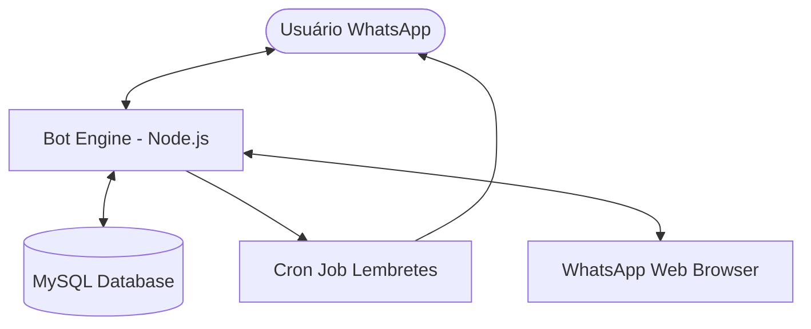

# 🤖 WhatsApp Scheduler Bot

<div align="center">
  
  
  
  
  
</div>

---

## 🎯 Objetivo & Problema

### O Problema
Gerenciar compromissos e tarefas manualmente através do WhatsApp pode ser caótico. Mensagens se perdem, lembretes são esquecidos e a organização individual sofre com a falta de automatização.

### A Solução
Este projeto é um **Assistente Inteligente de Agendamento** que transforma o WhatsApp em uma interface de produtividade robusta. Ele permite que usuários cadastrados agendem, editem e recebam lembretes de compromissos diretamente pelo chat, centralizando as informações em um banco de dados MySQL durável.

---

## 🏗️ Arquitetura

O sistema utiliza uma arquitetura baseada em eventos para interagir com a biblioteca `whatsapp-web.js` (uma camada sobre o Puppeteer) e um banco de dados relacional para persistência.

### Estrutura de Pastas (Modular)
```text
src/
├── config/     # Configurações globais
├── database/   # Repositório e conexão
├── handlers/   # Lógica do fluxo de conversa
├── services/   # Clientes WhatsApp e Cron
├── utils/      # Parsers e utilitários
└── index.js    # Ponto de entrada
```



**Principais Tecnologias:**
- **Runtime**: Node.js (ES Modules)
- **Integração**: `whatsapp-web.js` (Automação de navegador)
- **Banco de Dados**: MySQL (Persistência de Usuários e Compromissos)
- **Agendamento**: `node-cron`
- **Infraestrutura**: Docker & Docker Compose

---

## 🚀 Como Rodar

### 🛠️ Desenvolvimento (Local)

1. **Pré-requisitos**: Node.js 18+, MySQL.
2. **Setup**:
   ```bash
   npm install
   ```
3. **Configuração**:
   Crie um arquivo `.env` baseado no `.env.example`:
   ```env
   DB_HOST=localhost
   DB_USER=seu_usuario
   DB_PASSWORD=sua_senha
   DB_NAME=whatsapp_scheduler
   ```
4. **Execução**:
   ```bash
   npm run dev
   ```

### 🐳 Produção (Docker)

A forma recomendada de rodar em produção é utilizando Docker Compose para isolar a aplicação e o banco de dados.

```bash
docker-compose up -d --build
```

---

## 📱 Exemplos de Interação (Request/Response)

O bot utiliza um fluxo de conversação guiado por estados.

| Fluxo | Mensagem do Usuário | Resposta do Bot |
| :--- | :--- | :--- |
| **Menu** | `Olá` | `Olá [Nome]! 👋 Comandos disponíveis: AGENDAR, EDITAR, EXCLUIR...` |
| **Agendar** | `AGENDAR` | `Qual o assunto da Reunião/Tarefa?` |
| **Dados** | `Reunião de Alinhamento` | `Perfeito! Agora me diga qual a data? (Ex: 25/12)` |
| **Sucesso** | `25/12` | `Ótimo! Agora o horário? (Ex: 15:30)` |
| **Confirmação**| `15:30` | `Confirmado! Horário 15:30 salvo. Escolha a frequência...` |

---

## 🧪 Testes e Qualidade

O projeto conta com testes unitários para garantir a integridade dos parsers de data e hora.

```bash
# Rodar testes
npm test
```

A qualidade do código é monitorada via **GitHub Actions**, que executa o build e a suíte de testes em cada Push ou Pull Request.

---

## 🛡️ Segurança e Privacidade

- **LocalAuth**: A sessão do WhatsApp é criptografada e armazenada localmente.
- **Não Exposição**: Credenciais sensíveis e tokens de API nunca são comitados, utilizando variáveis de ambiente.
- **Puppeteer Headless**: Em ambiente Docker, o bot roda sem interface gráfica para maior eficiência.

---

<p align="center">
Desenvolvido por <strong>Roberto Lara</strong>
</p>
